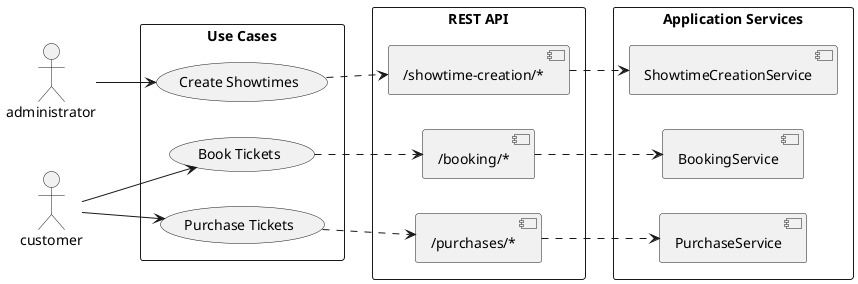

> **English** | [한국어](../ko/design-guide.md)

# Backend Design Guide

---

## 1. Service Architecture — SoLA (Service-oriented Layered Architecture)

### 1.0. System Overview

```
Client ── HTTP ──▶ Gateway ──┬──▶ Applications     (Business logic, async tasks)
                             ├──▶ Cores             (Domain models, data persistence)
                             └──▶ Infrastructures   (External service integrations)
```

| Layer               | Role                                       | Domains                                                                                       |
| ------------------- | ------------------------------------------ | --------------------------------------------------------------------------------------------- |
| **Gateway**         | API entry point, auth (JWT/Local)          | Customers, Movies, Theaters, Booking, Purchase, ShowtimeCreation                              |
| **Applications**    | Business orchestration, BullMQ async tasks | ShowtimeCreation, Booking, Purchase, Recommendation                                           |
| **Cores**           | Core domain entities, data persistence     | Customers, Movies, Theaters, Showtimes, Tickets, TicketHolding, PurchaseRecords, WatchRecords |
| **Infrastructures** | External service integration               | Payments, Assets(MinIO)                                                                       |

| Component   | Configuration                                     |
| ----------- | ------------------------------------------------- |
| **MongoDB** | 3-node replica set (27017-27019)                  |
| **Redis**   | 6-node cluster, 3 primary + 3 replica (6379-6384) |
| **MinIO**   | S3-compatible object storage (9000, console 9001) |

### 1.1. Problem: Circular References Between Modules

Without restrictions on inter-module references, a relationship that starts as A → B unidirectional can evolve into a circular reference as B → A references are added during feature expansion. When this happens, the two modules become effectively coupled as one. Changing A affects B, and changing B affects A in turn.

### 1.2. Solution: Layer Separation

This project separates modules into three layers and fundamentally prevents circular references. This structure is called SoLA (Service-oriented Layered Architecture).

A typical layered architecture only forbids upward references (lower → upper) and allows same-layer references. However, SoLA also **forbids references between modules in the same layer**. Allowing same-layer module references can eventually lead to circular dependencies. When multiple modules need to be composed, they must be assembled in an upper layer.

```
┌─────────────────────────────────────────┐
│         Application Services            │  Use case assembly, transaction management
│  ShowtimeCreation, Booking, Purchase    │
├─────────────────────────────────────────┤
│            Core Services                │  Core domain logic
│  Movies, Theaters, Showtimes, Tickets   │
├─────────────────────────────────────────┤
│        Infrastructure Services          │  External system integration
│           Payments, Assets              │
└─────────────────────────────────────────┘
```

**Dependency rules**:

1. **No same-layer references** — Services in the same layer are unaware of each other
2. Only upper layers can reference lower layers (Application → Core → Infrastructure, arrows indicate reference direction)
3. Lower layers are unaware of upper layers

### 1.3. Role of Each Layer

| Layer              | Role                                                                                                  | Can Reference        |
| ------------------ | ----------------------------------------------------------------------------------------------------- | -------------------- |
| **Application**    | Assembles user scenarios (e.g., create showtimes → create tickets). Drives transaction management.    | Core, Infrastructure |
| **Core**           | Handles core domain logic (e.g., movie management, theater management). Each service owns its own DB. | Infrastructure       |
| **Infrastructure** | Handles integration with external systems such as payments and storage.                               | None                 |

Just as objects are classified into Application, Domain, and Infrastructure layers, modules as a whole are divided by the same principle.

### 1.4. Application Service Design

Use cases, REST API namespaces, and Application Services correspond 1:1.



Starting from use cases, APIs are designed, and services are built to match the API structure, so the three layers naturally align. When this correspondence is maintained, use case → API → service can be consistently traced from anywhere in the code.

Application Services focus on their role as orchestrators. When business logic becomes complex, responsibilities are distributed to internal classes.

```
ShowtimeCreationService            (Orchestrator)
  └─ ShowtimeCreationWorkerService (BullMQ Worker, controls task flow)
       ├─ ShowtimeBulkValidatorService  (Request validation)
       └─ ShowtimeBulkCreatorService    (Showtime/Ticket creation)
```

---

## 2. REST API Design

### 2.1. Namespace

API paths use namespaces that reflect the use case context. Grouping APIs by namespace means the API rarely needs to change unless the use case requirements change significantly.

### 2.2. Long Query Parameters

APIs where query parameters can be lengthy are defined as POST.

```
POST /showtime-creation/showtimes/search
{
    "theaterIds": [...]
}
```

### 2.3. Async Requests

Long-running tasks return 202 Accepted and are processed asynchronously.

```
POST /showtime-creation/showtimes → 202 Accepted { sagaId }
SSE  /showtime-creation/event-stream → { status, sagaId }
```

---

## 3. Entity Design

### 3.1. Data Denormalization

Data is appropriately denormalized for query performance and **reduced coupling between layers**.

Storing `movieId` and `theaterId` redundantly in `Ticket` is a representative example. These values also exist in `Showtime`, but without redundant storage, `ShowtimesService` would need to be called for every query.

### 3.2. Entity vs Value Object

The same concept can be either an Entity or a Value Object depending on the domain context.

`Theater.seatmap` is a template for ticket creation. Customers find seats by `Block`, `Row`, and `Number` — they don't need a seat ID — so it is defined as a Value Object.

### 3.3. sagaId

A `sagaId` attribute is added to related entities for tracking and canceling async bulk operations.

---

## 4. Service Call Flow

REST API calls inject and execute services directly from HTTP controllers.

```
┌─────────────────────────────┐      ┌──────────────────────┐
│  #1 Gateway HTTP Controller ├─────>│    #2 Service        │
└─────────────────────────────┘      └──────────────────────┘
```

```
apps
├── gateway
│   └── controllers
│       └── #1 movies.http-controller.ts
│
└── cores
    └── services
        └── movies
            └── #2 movies.service.ts
```

---

## 5. Service Naming Rules

Process-oriented services use singular names; entity management services use plural names.

| Type                       | Example                             | Description                |
| -------------------------- | ----------------------------------- | -------------------------- |
| Process (singular)         | `BookingService`, `PurchaseService` | Handles a specific process |
| Entity management (plural) | `MoviesService`, `TheatersService`  | Handles entity CRUD        |

The `Service` suffix is used **only when a class directly calls other services to perform its work**. When it receives data from the caller and only performs computation, no suffix is added.

```
ShowtimeBulkValidatorService  ← Directly calls Showtimes/Movies/Theaters services
ShowtimeBulkValidator         ← Caller injects data; performs validation computation only
```

---

## 6. Singular/Plural API Design

Query and delete APIs that only take IDs are designed as **plural from the start**. This prevents having to change the API later when batch processing becomes needed.

```ts
// APIs that take only IDs — plural
getMany(theaterIds: string[]) {}
deleteMany(theaterIds: string[]) {}

// Create/update — singular
create(createDto: CreateTheaterDto) {}
update(updateDto: UpdateTheaterDto) {}
```

When a single request is needed from the REST API, the Gateway Controller wraps it in an array.

```ts
@Get(':theaterId')
async getTheater(@Param('theaterId') theaterId: string) {
    return this.theatersService.getMany([theaterId])
}
```

---

## 7. Error Messages

- Must always include a **language-neutral code**. Internationalization is the client's responsibility.
- `message` is briefly described for reference purposes.
- Codes are included **only when the HTTP status is in the 4xx range**. 5xx errors are server failures, so detailed causes are not exposed to clients.

---
